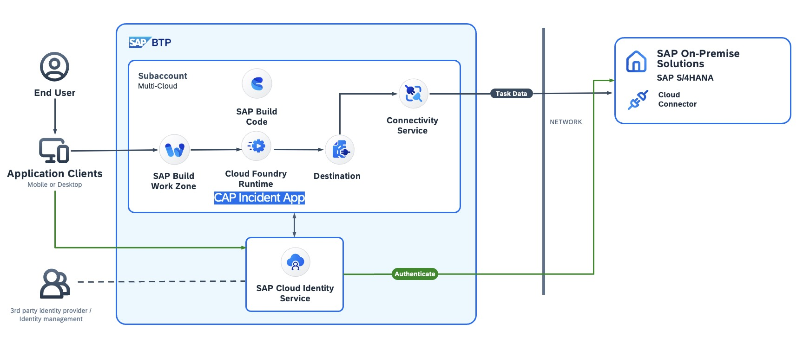

# AD160 - Get Hands-On with Joule: Boost Your SAP Build Development with AI

## Description

This repository contains the material for the SAP TechEd 2025 session called AD160 - Get Hands-On with Joule: Boost Your SAP Build Development with AI.  

## Overview

This session introduces attendees to AI Driven development. You will create a new lightweight incident management application on the SAP BTP using SAP Build Code with the new agnetic coding capabilities provided by SAP's MCP servers. The application will be based on the SAP Cloud Application Programming Model (CAP) in the backend and have an SAP Fiori Elements UI as frontend. The application will also have a connectivity from the SAP BTP to an SAP S/4HANA system. 

 

## Requirements

The instructors will assign a user and a password to you.

The user will be something along the line of lowcodeuser+0XXX@gmail.com where XXX is a unique number that is assigned to you. 

In a browser, preferably Google Chrome open the SAP Build Lobby https://lcapteched.eu10.build.cloud.sap/lobby and log on with the user and the password.

## Exercises

The exercise is divided in two parts. In the Getting Started section we will introduce you into the AI concepts we are using and are going to set these up. 
In exercise 1 we will connect to the S/4 system and create an application to manage incidents. 

- [Getting Started](exercises/ex0/)
- [Exercise 1 - Create an Incident Management app with agentic AI](exercises/ex1/):

       1.1 Creating an Incident Management Application with AI Agents in SAP Build Code

       1.2 Create and explore a CAP Model

       1.3 Use AI Agents to add UIs to the application

       1.4 Add attachments to the application 

- [Exercise 2 - Optional Part: Add attachments to the application ](exercises/ex2/)
  
Start the exercises [here](exercises/ex0/).

## Contributing
Please read the [CONTRIBUTING.md](./CONTRIBUTING.md) to understand the contribution guidelines.

## Code of Conduct
Please read the [SAP Open Source Code of Conduct](https://github.com/SAP-samples/.github/blob/main/CODE_OF_CONDUCT.md).

## How to obtain support

Support for the content in this repository is available during the actual time of the online session for which this content has been designed. Otherwise, you may request support via the [Issues](../../issues) tab.

## License
Copyright (c) 2024 SAP SE or an SAP affiliate company. All rights reserved. This project is licensed under the Apache Software License, version 2.0 except as noted otherwise in the [LICENSE](LICENSES/Apache-2.0.txt) file.
