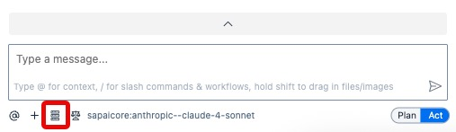

# Exercise 0 - Introduction

In this exercise, we will explain the concepts we are using in the exercise and set up our environment.

## Exercise 0.1 Learning: What is Agentic Coding?

Agentic coding is a software development approach in which autonomous AI agents plan, write, test, and optimize code independently according to high-level goals, minimizing the need for ongoing human direction. These agents can reason about requirements, break down tasks, collaborate, and iteratively improve solutions—essentially transforming the developer’s role from manual implementer to supervisor and goal-definer. 

### Key Features  
- Autonomous code generation and modification by AI agents.
- High-level objectives are translated into actionable development plans with minimal human intervention.
- Proactive error detection, self-testing, and optimization.
- Agentic systems can coordinate multiple agents for different roles, from architecture to deployment.
- Continuous and adaptive enhancement of codebases.  

Agentic coding represents a paradigm shift, optimizing for system-wide intelligence and automated collaboration rather than individual developer output.


## Exercise 0.2 Learning: What are MCP servers?

The Model Context Protocol (MCP) is the "USB-C port for AI". It is an open standard designed to create a universal connection between AI models, and external data sources, tools, and systems. It aims to replace the fragmented system of custom integrations with a single, standardized protocol, making it easier for AI to access and interact with the information it needs to provide more relevant and capable responses.

## How does it work
MCP operates on a client-server architecture, which simplifies communication between AI applications and external systems:
 - Host Application: This is the AI application, such as an LLM chat interface or an AI-enhanced code editor, that interacts with the user and initiates connections.
 - MCP Client: Integrated within the host application, the client translates the host’s needs into the MCP standard and manages the connection to MCP servers.
 - MCP Server: This is a service that exposes a specific data source or tool (like a GitHub repository, a database, or the SAP Tools) to the AI system through the MCP standard.


## Key Features and Capabilities
MCP allows developers to build more powerful and integrated AI systems by providing a standard way for them to:
 - Share Resources: Provide contextual information and data from external systems to the AI model.
 - Expose Tools: Enable the AI model to execute functions and interact with external applications, such as running code or accessing APIs.
 - Initiate Prompts: Use pre-defined message templates and workflows to guide user interactions.
 - Handle Security: The protocol includes principles for user consent, data privacy, and tool safety, though implementation is the responsibility of the developers.

## Which MCP servers does SAP provide?

SAP is committed to meeting developers where they’re at – that means no matter where or how you code, you have the freedom to choose the environment that best suits your needs and access to the tools that maximize your productivity and impact.

SAP is introducing Model Context Protocol (MCP) servers to boost development with the following technologies:

- SAP Cloud Application Programming Model (CAP)
- SAP Fiori Elements 
- SAPUI5 
- Mobile Development Kit (MDK): Not covered in this tutorial

By adopting these new MCP standards, developers can seamlessly extend SAP’s development capabilities into multiple environments, ensuring flexibility and choice. SAP Build now enhances popular IDEs and AI coding assistants such as Cursor, Windsurf, Github Copilot, Cline and Claude Code.

The SAP MCP Servers are being released as open-source projects, licensed under the Apache-2.0 license. This marks another step in our commitment to openness and community-driven innovation.

Value of SAP MCP Tools:
- Best Practices Built-In: Generated code with SAP CAP, SAPUI5 and  SAP Fiori Elements code already provides you with the right starting point for reaching SAP standards and proven design guidelines.
- Guided Development: Developers receive recommendations and guardrails tailored to SAP Business Technology Platform (BTP).
- Consistency:  SAP’s MCP tools are and will be reused across our tooling portfolio, ensuring consistent developer experience and outcomes wherever you build SAP applications. Whether you’re generating backend services, UIs, or business logic, you can rely on the same quality, structure, and compliance.

If you want to get more information after the workshop, click here: [SAP MCP server](https://community.sap.com/t5/technology-blog-posts-by-sap/sap-build-introduces-new-mcp-servers-to-enable-agentic-development-for/ba-p/14205602)


## Exercise 0.3 Installation of an AI Agent

In this exercise we will use Cline, an Autonomous coding agent, which can be added to your IDE. If you want to find out more information about Cline, click here [Cline Github](https://github.com/cline/cline)

To save some time in this hands-on, we already set up Cline with an SAP AI Core integration in SAP Build Code. 

<details>
<summary><b>Manual installation of Cline</b></summary>
If you want to set it up after this hands-on on your machine, you will find the documentation here: [Cline + SAP AI Core](https://architecture.learning.sap.com/docs/ref-arch/e5eb3b9b1d/10)

This documentation will also work with SAP Build Code. To open the extensions click on the menu icon, select View -> Extensions. Confirm with ok and search for *Cline*. Install the extension.
</details>
<details>
<summary><b>BAS Cline MCP config</b></summary>

```
{
  "mcpServers": {
    "cds-mcp": {
      "disabled": false,
      "timeout": 60,
      "type": "stdio",
      "command": "node",
      "args": [
        "/home/user/.node_modules_global/lib/node_modules/@cap-js/mcp-server/index.js"
      ],
      "env": {
        "PATH": "/home/user/.asdf/bin:"
      }
    },
    "fiori-mcp": {
      "disabled": false,
      "timeout": 60,
      "type": "stdio",
      "command": "node",
      "args": [
        "/home/user/.node_modules_global/lib/node_modules/@sap-ux/fiori-mcp-server/dist/index.js"
      ],
      "env": {
        "PATH": "/home/user/.asdf/bin:"
      }
    },
    "ui5-mcp": {
      "disabled": false,
      "timeout": 60,
      "type": "stdio",
      "command": "node",
      "args": [
        "/home/user/.node_modules_global/lib/node_modules/@ui5/mcp-server/bin/ui5mcp.js"
      ],
      "env": {
        "PATH": "/home/user/.asdf/bin:"
      }
    }
  }
}
```

</details>

## Exercise 0.4 Add instructions to the AI agents
To ensure that the AI produces correct results, we propose rules that guide the LLM’s behavior. For example in the CAP MCP server, we define that the MCP server is always used when it searches for CDS definitions.
We are now defining rules to help the LLM use the server correctly. It is a combination of rules for CAP and Fiori Elements and store in an agents.md file in your dev space. 

We already have done that for you. 


```
## Guidelines for CAP

- You MUST search for CDS definitions, like entities, fields and services (which include HTTP endpoints) with cds-mcp, only if it fails you MAY read \*.cds files in the project.
- You MUST search for CAP docs with cds-mcp EVERY TIME you create, modify CDS models or when using APIs or the `cds` CLI from CAP. Do NOT propose, suggest or make any changes without first checking it.

## Rules for creation or modification of SAP Fiori elements apps

- When asked to create an SAP Fiori elements app check whether the user input can be interpreted as an application organized into one or more pages containing table data or forms, these can be translated into a SAP Fiori elements application, else ask the user for suitable input.
- The application typically starts with a List Report page showing the data of the base entity of the application in a table. Details of a specific table row are shown in the ObjectPage. This first Object Page is therefore based on the base entity of the application.
- An Object Page can contain one or more table sections based on to-many associations of its entity type. The details of a table section row can be shown in an another Object Page based on the associations target entity.
- The data model must be suitable for usage in a SAP Fiori elements frontend application. So there must be one main entity and one or more navigation properties to related entities.
- Each property of an entity must have a proper datatype.
- For all entities in the data model provide primary keys of type UUID.
- When creating sample data in CSV files, all primary keys and foreign keys MUST be in UUID format (e.g., `550e8400-e29b-41d4-a716-446655440001`).
- When generating or modifying the SAP Fiori elements application on top of the CAP service use the Fiori MCP server if available.
- When attempting to modify the SAP Fiori elements application like adding columns you must not use the screen personalization but instead modify the code of the project, before this first check whether an MCP server provides a suitable function.
- When previewing the SAP Fiori elements application use the most specific script for the app in the `package.json`.
```

<details>
<summary><b>Manual installation, if you are at home</b></summary>

Open Cline and click on the rules icon.



Press the **+** icon next to the Global rules. Provide any name like **SAP** and press enter. Afterwards add the rules mentioned above into the file.


</details>

## Summary

You've now learnt what Agentic AI and MCP is and we setup our development environment. Let's jump into the first part of the exercise [Exercise 1 - Create a CAP application ](../ex1/README.md)


