# Exercise 1 - Exercise 1 Description

# Creating an Incident Management Application with AI Agents in SAP Build Code

We are using SAP Build Code, which provides a powerful, cloud-based development environment optimized specifically for the SAP ecosystem, which accelerates the creation of business applications and extensions. As a central entry point for the SAP Build portfolio we start in the SAP Build Lobby.

1.    Go to the SAP Build Lobby https://lcapteched.eu10.build.cloud.sap/lobby  to create a new application.
2.    Click the Create button to begin -> By clicking on *Create* you can choose between ,,Create’’ ,,Clone from Git’’ and ,,Add from Dev Space’’ -> Choose *Create*


3. Next, choose *Build an Application* from the available options 
4. Pick *SAP Build Code* to build your app 
5. Select *Full-Stack Application* as development configuration for your scenario 
6. Enter a project name, for example *incidentmanagementXXX*, where XXX is the number of your previously assigned user. (The number is added to the project name to make sure your project is different from the ones of other users of this tutorial in case you want to deploy the application to the SAP Business Technology Platform (BTP)).
7. Under ''Development Stack'', select *Node.js* 
8. Click *create* to finalize the setup and start working on your application

A new project will be created. This will take a few minutes. When the process is complete, your new application will appear in the SAP Build Lobby under *My projects*

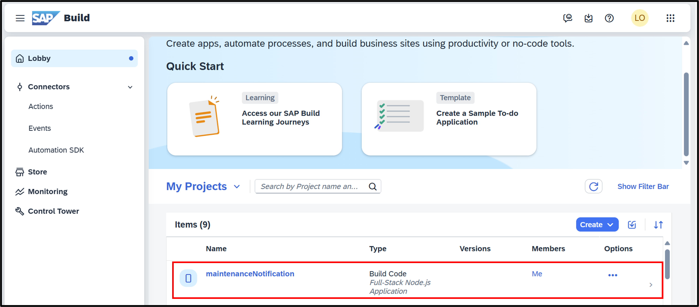 

9. Once your application is created, click on its name to open it. This will launch the SAP Build Code.

    
### Create and explore a CAP Model

**Aditional allinoneprompt**
 Application Details: Application will be used to manage incidents. Each incident will have priority and status to indicate importance of it. Incident can also be updated with comments to indicate progress. afterwards generate the UI. I don't want to deploy it to sap hana, for now only want to test it locally.

At first, the project will be empty. Next step is to create a CAP (Cloud Application Programming) data model and a service for the incidents. This can either be done manually or with the help of Joule, the digital assistant. 

Ask Joule to create a new CAP application:

1.    Open Joule by clicking its icon on the left side bar   (see below screenshot).

2.    We want to start to create the incident management application. In the first step only the data model, service and sample data should be created. Copy and paste the following prompt in the input field: 

```
create a CAP application for managing customer support incidents:

•               Incidents are reported by Customers and contain details like title, urgency, status, and a conversation log (messages with timestamps and authors).              
•               Customers have personal/contact information and a list of their incidents and addresses.
•               Addresses are related to Customers and store location details.
•               Status and Urgency are code lists, enumerating possible incident states (new, assigned, etc.) and urgency levels (high, medium, low).
Create only the data model, sample data and service. use cds-mcp. use cds init incients to create the project.
```
                  
**Insert Screenshot**

What will happen now:
It is recognized that the CAP MCP should be used, which will use the search_docs tool to get the latest CAP documentation to execute your prompt.
Sometimes to need to approve that.

Now you should get an proposed Data Model Architecture, which could look like this:
## Proposed Data Model Architecture

### Core Entities:

1. __Incidents__ - Main entity for support tickets

   - ID (UUID, primary key)
   - title (String)
   - description (String, longer text)
   - status (Association to Status code list)
   - urgency (Association to Urgency code list)
   - customer (Association to Customers)
   - conversation (Composition of many Messages)
   - Created/modified timestamps (using managed aspect)

2. __Customers__ - Customer information

   - ID (UUID, primary key)
   - firstName, lastName (String)
   - email (String)
   - phone (String)
   - incidents (Association to many Incidents)
   - addresses (Composition of many Addresses)
   - Created/modified timestamps (using managed aspect)

3. __Addresses__ - Customer address information

   - ID (UUID, primary key)
   - customer (Association to Customers)
   - street, city, postalCode, country (String fields)
   - addressType (String) - e.g., "billing", "shipping", "primary"
   - Created/modified timestamps (using managed aspect)

4. __Messages__ - Conversation log for incidents

   - ID (UUID, primary key)
   - incident (Association to Incidents)
   - author (String) - could be customer name or support agent
   - content (String)
   - timestamp (DateTime)
   - isInternal (Boolean) - to distinguish internal notes from customer-visible messages

5. __Status__ - Code list for incident status

   - code (String, primary key) - "new", "assigned", "in_progress", "resolved", "closed"
   - name (localized String)

6. __Urgency__ - Code list for urgency levels

   - code (String, primary key) - "low", "medium", "high", "critical"
   - name (localized String)


As a next step an implementatio Plan should be displayed.
- __Initialize CAP Project__
- __Create Data Model__ (db/schema.cds)
- __Create Service Definition__ (srv/incidents-service.cds)
- __Generate Sample Data__

You can now modify or accept the proposal and the agent will generate the necessary files.
If you navigate now to your project, your file strcture should contain these files:
 


Open the terminal **cds watch** to start a preview of the service.:
```
cds watch
```

Click on **http://localhost:4004** to open the preview

Now select **Fiori Preview** for the incidents


Add columns to see the content, therefore select the gearwheel in the middle of the UI and select all Columns afterwards.


You will see now all the sample data.


Go back to the development environment.
Now let's add some SAP Fiori Elements UI on top.

```
use the fiori-mcp to add UIs to the application
```

First it will call the list_functionality tool. Second it will call the get_functionality_details.
Probably the cds-mcap is used for the search_model tool

Create a Fiori elements list report on top for the risks.
add additional Fiori Elements pages for customer, address, incidentmessages, status and urgency. Add the incidentsmessages to the details of the incidents


Logic extension:
If an incident is closed, it cannot be modify anymore.
If the title of an incidents includes urgent, set the urgency to high.

3. Click send to submit the request 

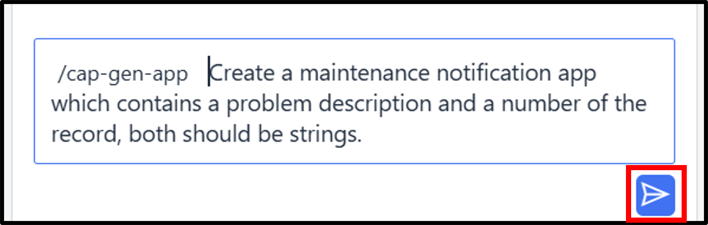 

4. Review the generated result – it should look as in the screenshot – and accept it by clicking the *Accept* button. Now the data model and service are taken over into the story board. It should look like this:

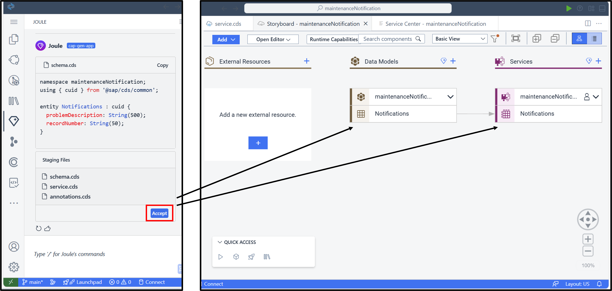 

A CAP service always consists of one or many entities that are the data model. Once the application is tested or deployed these entities result in database tables. On top of these, you have one to many services, that itself consist of service entities. These service entities are always so-called projections on one or many data model entities. In the service entities you can add or omit properties of data model entities, change their names, or create joins on several data model entities. 

In this example, Joule has created a simple data model with just one entity and a service that has a service entity with a 1 to 1 projection to the data model entity. 
This is a very simple model. Depending on the complexity of the ask in the prompt, Joule can also generate multiple entities with more properties and which each of the entities in a relationship (association or composition) with other entities.

5.    You can review change, and enhance the new data model and the service at any time by entering the “Graphical Modeler”. For this, click on the *MaintenanceNotification* entry under Data Models and then select the *Open in Graphical Modeler* entry in the dialog.

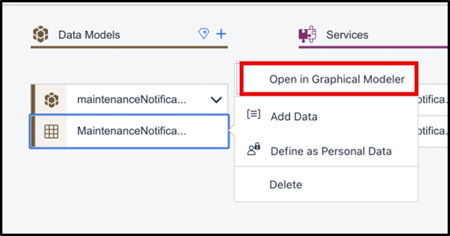

You can now see the AI generated entity and all the properties in it. If you click on its header, you get a new menu to the side. 

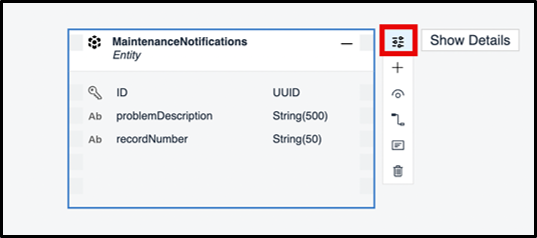

6.    Click on the *Show Details* entry. This will open a side pane on the right. You could change the properties of the entity, delete some of them, or create new ones.

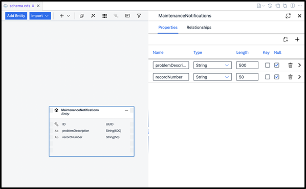

Also of course you could create new entities with properties and create relationships like associations or compositions between the entities. We are not going to do this here, though.

Apart from creating assets using Joule and AI or the Graphical Modeler, it is also possible to create and edit data models (and others) with textual editors. 

7.    To do so, press on the *Explorer* icon on the left side pane. You can now see the folders and files which make up your project. 
8.    Look for the *db* folder, this is where in CAP normally the data models are situated. 
9.    Click on the *schema.cds* file. A text editor opens displaying syntax highlights for the Core Data Services (CDS) content which describes the new entity. At any time in the project you could change this file manually, resulting in changes of the data model. Again, we are not going to do this here. 
10.    Once you are finished exploring, close the text editor, and press on the *Explorer* icon in the left pane again to close the file explorer view. 

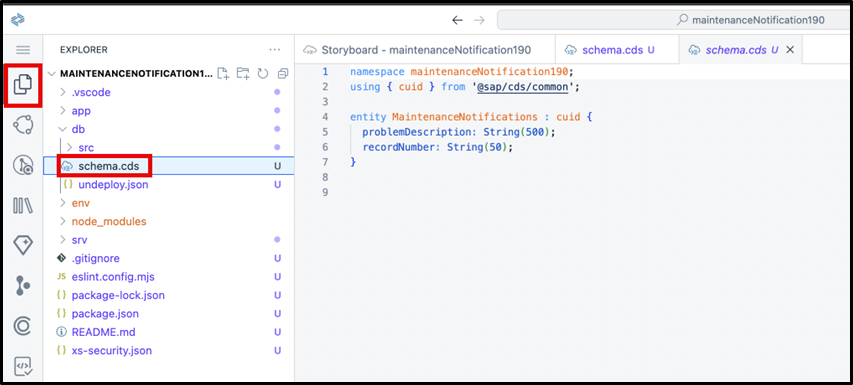 

11.    Click on the *Storyboard* tab on the top to bring the Storyboard in focus

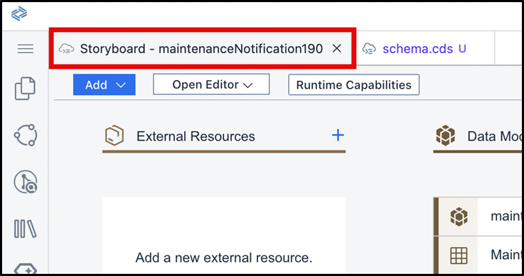

With the single prompt we have already created a complete CAP service. It is exposed as a CRUD enabled OData service which means it supports create, read, update and delete operations.
### Import an SAP S/4HANA API: Add a new External Resource
1.    In the *Add new external resource section*, click the + button

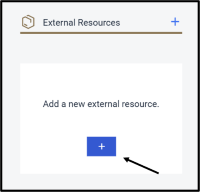

2. You are directed into the Service Center, showing those APIs the administrator has set up for you via the *SAP Systems* choice. 
BTP offers multiple ways to explore available APIs. The selected *SAP System* one provides the APIs that were added as BTP destinations for APIs or API catalogues.
Another option is SAP Business Accelerator Hub, which shows all the publicly available APIs from all SAP products, that you can also find directly in the SAP Business Accelerator Hub (https://api.sap.com/)   
A third option is the *Developer Hub*, see [here](https://help.sap.com/docs/integration-suite/sap-integration-suite/developer-hub), where administrators can carefully curate and govern which APIs are published to developers and to manage these APIs by securing, applying transformation or traffic management options.
The last option is the *Unfied Customer Landscape*, which shows all the APIs that are part of a customer’s SAP and Third Party landscape.
3.    Take some time to explore these other options separately.
4.    Turn to the preselected *SAP System* choice.
5.    Under Services, select API_MAINTNOTIFICATION_CC7. This is one of the public SAP S/4HANA APIs, that can be found on the SAP Business Accelerator Hub, as well.
   
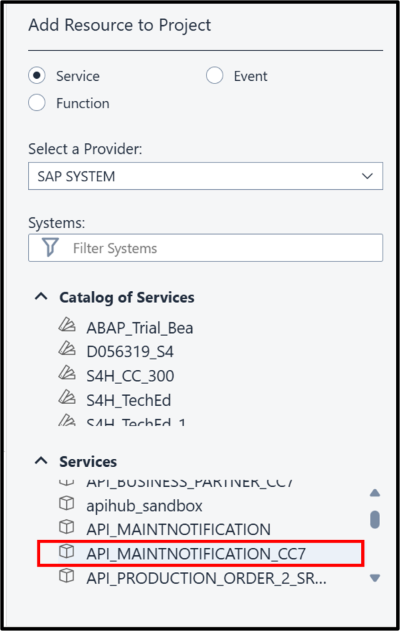

6.    Explore its entities and respective details on the right. You can also press on the *Live Data* tab on the details view. As the SAP System APIs are connected to real backed systems, you can see some of the API’s data from this system.
7.    Select *Add to Project*. The API pops up in the storyboard next to the data model and the service as External Resource. 

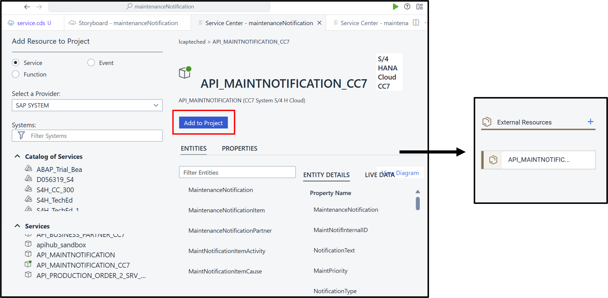

### Add Logic to Create a Maintenance Notification 
Next step is to add the logic to create a new maintenance notification every time a notification is created on the SAP BTP. For this we will create a new **CAP handler**, which is invoked **before** a new notification is created in CAP. 
1.    On the Storyboard under Services, select *MaintenanceNotification* -> Then click *Add Logic*

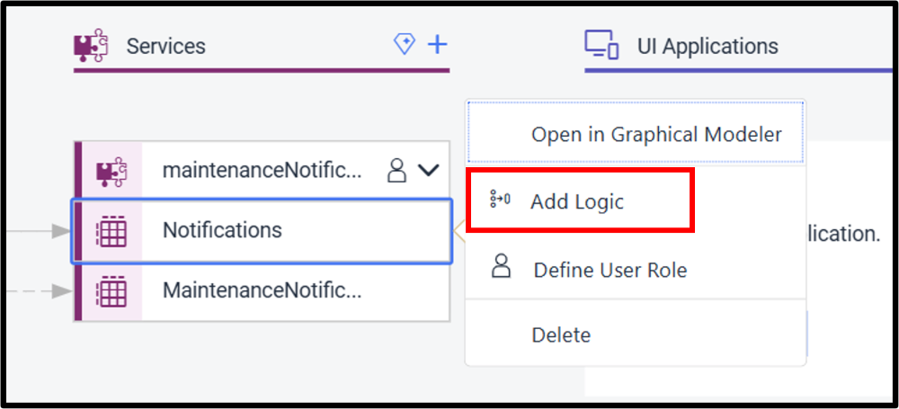

2.    A dialog box will appear with pre-filled information and looks like this:

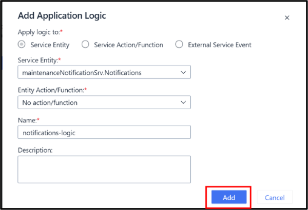

3.    Click *Add* to confirm 
4.    On the configuration screen:

      a.    Under Phase, select *Before* as trigger timing (see below)

      b.    Under *Standard Event*, select *Create*

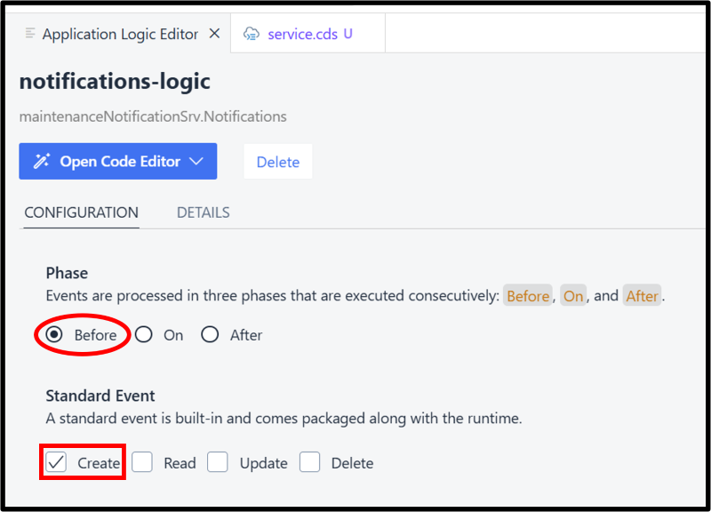

5.    Click *Open Code Editor* at the top of the Application Logic Editor. This will open a dialog box. 
6.    Select *Application Logic*
7.    The *notification-logic.js* tab will open
8.    Go to Joule to ask for creating a new maintenance notification with certain data and to take over the new record number. For this, enter this prompt:

*/cap-app-logic #srv/code/maintenancenotifications-logic.js
For each new notification create also a new Maintenance Notification, connecting to and then calling the external service. The Maintenance Notification should have a notification type of ‘M1’ and its notification text should be the problem description of the notification. Update the notification’s record number from the MaintenanceNotification field of the new Maintenance Notification.*

Your screen will look like this:

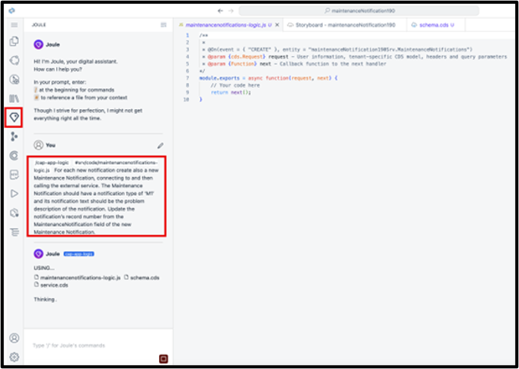

9.    When Joule has created a proposal, review the generated code then accept the code by clicking *Accept*

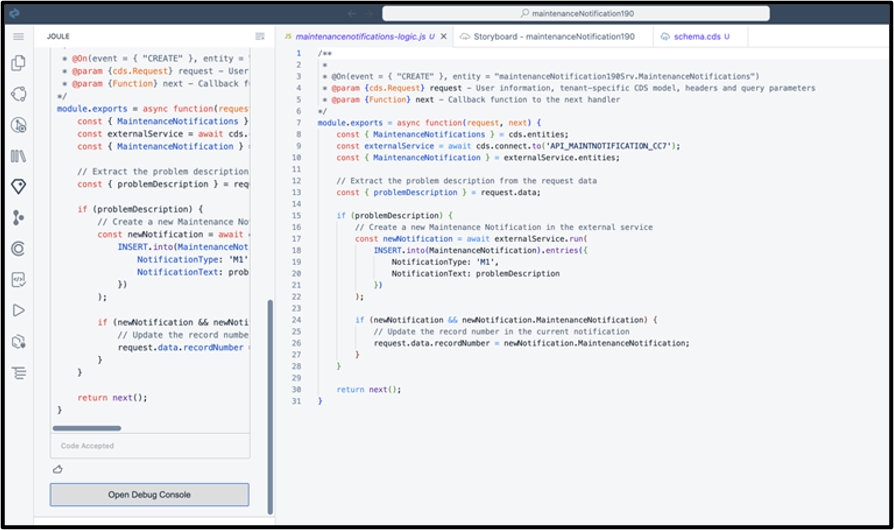

10.    Let’s analyze the generated code a bit:
It might not look exactly like in the above screenshot, but your AI generated version will be similar.
In the above version, the following things are happening:

•    In line 9, CAP creates a connection to the external SAP S/4HANA service that has been imported

•    In line 15, there is a check whether the user has provided a problem description

•    If so, CAP invokes a *write call* for the SAP S/4HANA API to create a new maintenance notification instance in the SAP S/HANA system. For this, it uses the problem description text and the fixed type *M1* – exactly how Joule has been asked to do so. This also shows a nice feature in CAP: The way to invoke a *create request* for an OData API like the API_MAINTENANCENOTIFICATION looks very much like an SQL statement to a data base table. This is by intention. CAP offers this unified way of accessing APIs and database artefacts via the so called *CDS Query Language* (CQL)

•    In line 24, it then checks whether a new maintenance notification was indeed created in SAP S/4HANA and if so:

•    It copies the SAP S/4HANA maintenance notification number into the field *recordNumber* from the local entity that has been created at the beginning of this tutorial.

Now this would already be valid code. However, real error handling is still missing. If, for example, the creation of the new maintenance notification would fail, e.g. because of network issues, the user would not really get notified so far. Plus, a situation would occur where there is a new notification instance on the BTP but no corresponding instance on SAP S/4HANA for a maintenance notification to back it up. This means, the result can be an inconsistent overall situation. This should be avoided. Therefore, the next step will be to enhance the code with error handling with the help of Joule.

1.    In Joule enter this prompt:

*/cap-app-logic #srv/code/maintenancenotifications-logic.js add error handling. If the creation of the maintenance notification fails, the notification should also not be created and an error issued.*

2.    After Joule has created a proposal, review the generated code and accept the code by clicking *Accept*

The result should look like this:

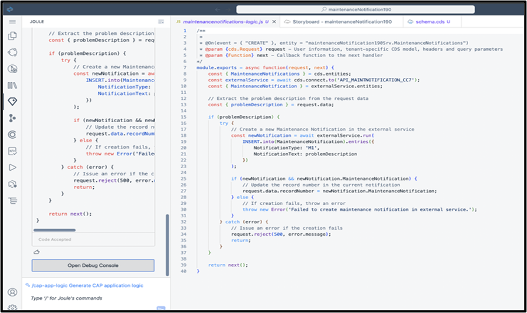

Let’s check the new code again:

•    The upper part of the code is largely unchanged, apart from the new line 16 where a *try statement* makes sure any error from the backend call in line 19 can be caught and handled.

•    As of line 28, the new error handling that Joule added kicks in. If there is no new maintenance notification created after the API call, the user gets a message and an error is thrown.

•    If an error is thrown, then it is handled in line 32 and in line 34, the request is rejected. This means that the creation of the notification on the BTP is terminated and so, if the creation of an SAP S/4HANA maintenance notification fails, also the BTP notification is not created.

3.    Return to the storyboard.

The creation of the backend service in CAP for the tutorial scenario is now finished.

### Create a UI Application 

Next step is to add a UI application to create and edit BTP notifications as well as listing existing ones. For this, a new SAP Fiori elements application with a List Report and Object Page floor plan will be created. This template-based app creation approach fits quite well to this requirement and comes with lots of standard functionality out of the box, as well as adhering to the latest SAP Fiori-based UX.

1.    On the Storyboard go to the *UI Applications* section
2.    Click the + button to create a new UI application
3.    Enter *Notifications* as the Display name
4.    Under Data Source:

a.    Open the dropdown menu

b.    Select your service maintenanceNotificationsXXXSrv  

c.    Click *next* to go to the UI Application Template

d.  Select Template-based, Reponsive Application

This generates an SAP Fiori application which is intended for desktop use mainly. It, however, works on tablets on mobile phones, as well. 

If the main use case would be on the mobile phone, Mobile-Centric, Freestyle Application should be chosen which would create a new Mobile Development Kit (MDK) app. This works on mobile or tablet the best, it also works on a desktop, but it is not as optimized for it as the SAP Fiori elements app is. 


5.    Select the *List Report Page* template and press *Next*. This chooses the right floorplan for our application
6.    In the last step, ensure that the new application is based on the *Main entity* which is your CAP service. As you project consists of only one service and one service entity this is already preselected in the right way.
7.    Click *Finish*

You will be taken back to the Storyboard. The generation of the UI takes a couple of seconds, and the UI application will be added to the storyboard.

Then, again after a couple of seconds, the Page Map will open automatically, and you will see two pages: A *List Report* and an *Object Page*:

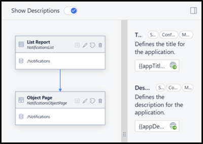

### Adjust the UI Application 

The result of everything that has been done up until now is a running SAP Fiori application. As the CAP service retrieves the record number automatically from the SAP S/4HANA object, it needs to be prevented that the user adds the number manually in an input field of the new UI application. Therefore, a modification to make the Record Number field read-only needs to be added.

1.    Select the Object Page and click on the pencil icon to configure the page

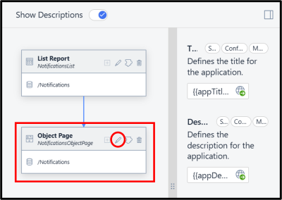

2.    Under *Sections* you can find General *Information* -> Expand

a. Under the drop down you will find *Form* -> Expand
   
b.    Under the drop down you will find *Fields* -> Expand -> Click on *Record Number*

3.    In the side menu that appears, scroll go down to *Restrictions*
4.    In the drop down, select *Read Only*

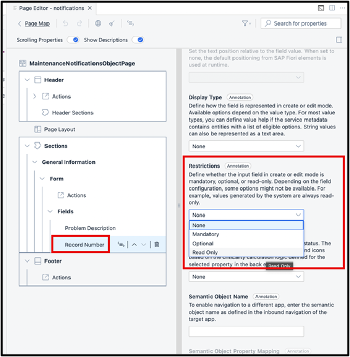

5.    Close the Page Map tab.

The creation of the new UI application is now finished.

### Preview the Application 

The resulting full-stack application consists of a CAP service and a SAP Fiori elements application, where the CAP service invokes the creation of a new maintenance notification in SAP S/4HANA for each new SAP BTP notification. The application can now be deployed to the SAP BTP. 

However, to test whether the application works, a deployment is not necessary, yet. Instead, it can be started it in *preview mode* directly:

1.    Go to the Storyboard
2.    At the very top, on the right click *Preview*

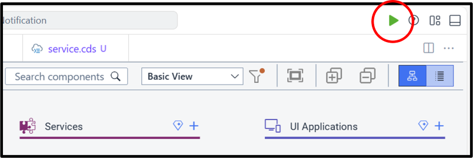

A text box will appear in the upper middle of the screen asking, *"What would you like to run?"*

3.    Select *API_MAINTENANCENOTIFICATION_CC7.* 
The difference between this option and the other one (called *Run maintenanceNotificationXXX* ) is how the preview treats the calling of the SAP S/4HANA API. With *API_MAINTENANCENOTIFICATAION_CC7*, any call to the API from the CAP handler will result in an actual call of the API in the SAP S/4HANA system. In case Run *maintenanceNotificationXXX* is chosen instead, CAP tries to get some sample data instead that we could have created. This is to ensure that the application can be tested even if there are, for example, network issues or the SAP S/4HANA system is down for maintenance. In our case, we want to use the real API though.

4.    After a few seconds, a new tab will open showing an overview page called *Application Development Project Preview.*
5.    On the landing page, under My Home, you see a tile for the UI application *Notifications*.  On the right-hand side, you can also see a *Services* section. Here you could explore the OData service and, for example, play around with queries.
6.    Press on the button:

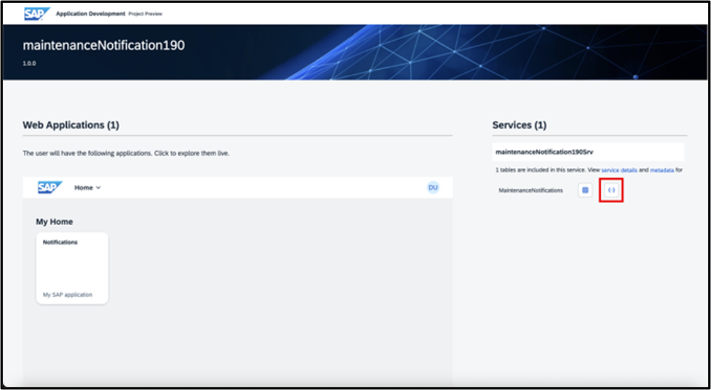

This will open a new tab, and you see a *read* operation performed on the notifications service entity. As there are no notifications, yet, an empty JSON is returned. In general, you can play around with the service here.

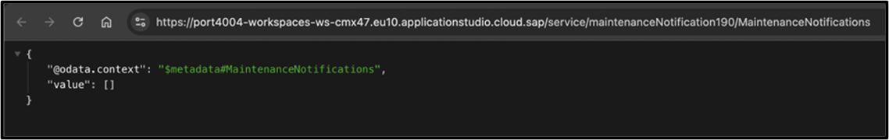

7.    Go back to the *Application Development Project Preview* tab
8.    Click the *Notification* tile to start the app -> A new tab will open
10.    Create a new notification in the app by clicking *create* at the top right of the screen.

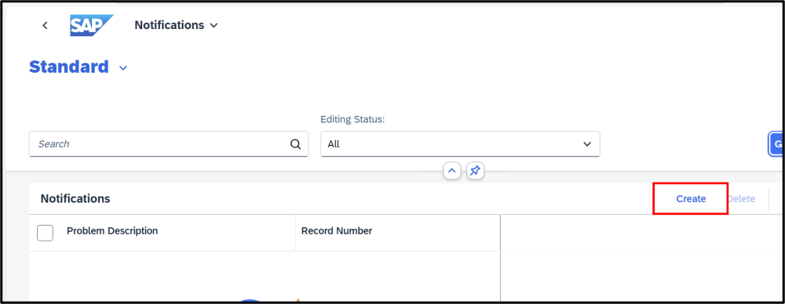

A new page opens where the Problem Description can be entered.

10.    Enter *Printer doesn’t work*. Note how the *Record Numbe*r field is read only, as configured before.
11.    Press the *Create* button.

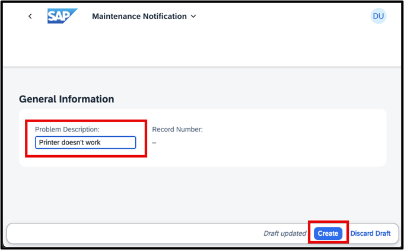 

In the SAP S/4HANA system, the corresponding maintenance notification is created. After a few seconds its record number pops up on the screen as a proof that indeed it was created.

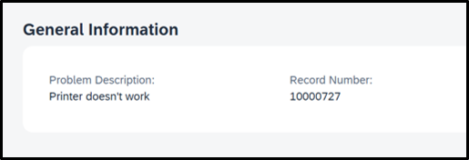

This completes the first part of the tutorial.

### Add attachments to the application 

In this part of the tutorial, another feature of the CAP framework will be added to the application: With each notification, the user should have an option to add an attachment, for example, a photo of the issue to accompany the problem description. For this, addition logic and an additional UI section is needed to maintain and show attachments for each notification. 

SAP Build Code via CAP and SAP Fiori elements make it easy to add this functionality:

1.    Open a new terminal by pressing the hamburger icon on the left side pane
2.    Select *Terminal*
3.    Select *New terminal*


4.    In the terminal, add the statement

`npm add @cap-js/attachments`

5.    Press *return*.


This will add a so-called *CAP plugin*, in this case one for attachment-handling. Behind the scenes, a dependency to this plugin will be added into the *package.json* file of the application and the plugin will be loaded.

6.    Open the file explorer by pressing on the corresponding icon in the left side pane.
7.    Open the *db* folder

   a. Click on the *schema.cds* file
   
   b. In this file, add the following line as the 2nd line: 

   `using { Attachments } from '@cap-js/attachments';`

   c. For the attachments, add 

   `attachments: Composition of many Attachments;` 

   as the last line in the entity like this: 

   `entity MaintenanceNotifications : cuid {`
  
  `problemDescription: String(500);`
  
  `recordNumber: String(50);`

  `attachments: Composition of many Attachments;` 

`}`

The result should look like this: 

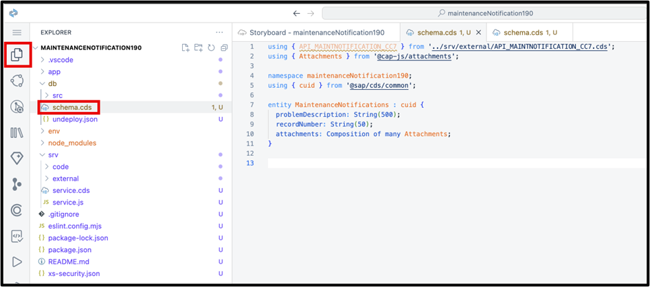 

What happened here? The Attachments plugin has been added to the file. As a last step, a new property needs to be created, called *attachments* here, which is a *Composition of Attachments.*

Let’s have a look at the result:

8. If you have stopped the preview, press the green arrow on the upper right of the Storyboard again. If the preview is still running, the application should have refreshed itself.

9.    On the *Application Development Project Preview* page, press the tile *Notifications* again.

10. Create a new notification in your app by clicking *create* which you can find at the top right. You should now see a new attachment section in the application.

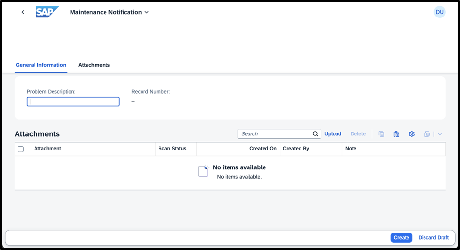 

New attachments can now be uploaded that will then appear in the list. You can also view them from that list. Each time creating a new notification with a description, the attachments will be stored alongside the notification.

This concludes the creation of a maintenance notification application with GenAI in SAP Build Code. 


## Exercise 1.1 Sub Exercise 1 Description

After completing these steps you will have created...

1. Click here.
<br>

2.	Insert this line of code.
```abap
response->set_text( |Hello World! | ). 
```


## Exercise 1.2 Sub Exercise 2 Description

After completing these steps you will have...

1.	Enter this code.
```abap
DATA(lt_params) = request->get_form_fields(  ).
READ TABLE lt_params REFERENCE INTO DATA(lr_params) WITH KEY name = 'cmd'.
  IF sy-subrc <> 0.
    response->set_status( i_code = 400
                     i_reason = 'Bad request').
    RETURN.
  ENDIF.

```

2.	Click here.
<br>


## Summary

You've now ...

Continue to - [Exercise 2 - Exercise 2 Description](../ex2/README.md)

