# Exercise 1 - Create an Incident Management app with agentic AI

### 1.1 Creating an Incident Management Application with AI Agents in SAP Build Code

We are using SAP Build Code, which provides a powerful, cloud-based development environment optimized specifically for the SAP ecosystem, which accelerates the creation of business applications and extensions. As a central entry point for the SAP Build portfolio we start in the SAP Build Lobby.

1.    Go to the SAP Build Lobby https://lcapteched.eu10.build.cloud.sap/lobby  to create a new application.
2.    Click the Create button to begin -> By clicking on *Create* you can choose between ,,Create’’ ,,Clone from Git’’ and ,,Add from Dev Space’’ -> Choose **Create**

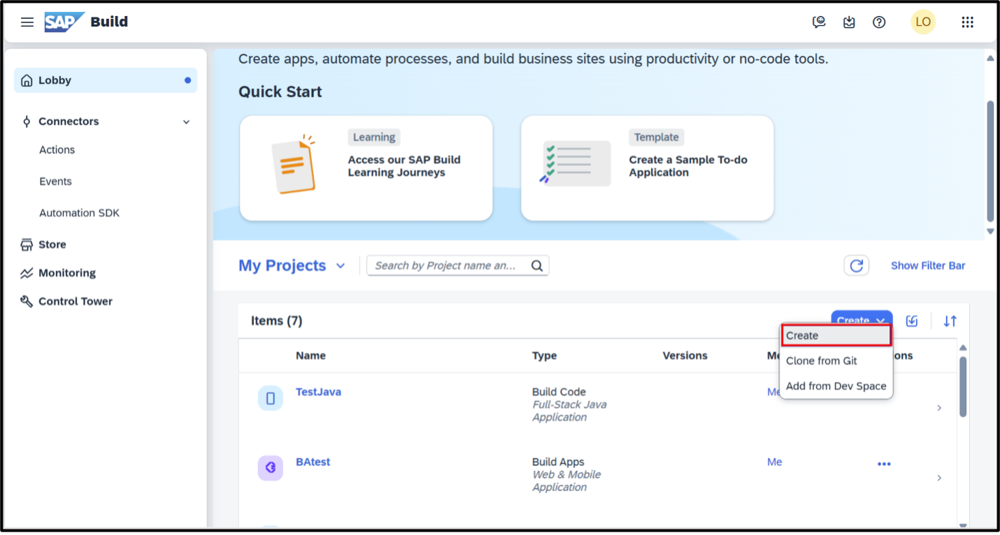

3. Next, choose **Application** from the available options 
4. Select **Full-Stack** as development configuration for your scenario. Press Next.
5. Select **Full-stack Node.JS** asruntime. Press Next.
6. Enter a project name, for example **incidentmanagementXXX**, where XXX is the number of your previously assigned user. (The number is added to the project name to make sure your project is different from the ones of other users of this tutorial in case you want to deploy the application to the SAP Business Technology Platform (BTP)).

   *hint* If the project name is already be used, as we run the hands-on several times, add another random number afterwards.
   
8. Don't change the Dev Space and press **Review**.
9. Click **Create** to finalize the setup and start working on your application

A new project will be created. This will take a few minutes. When the process is complete, your new application will appear in the SAP Build Lobby under **My Projects**

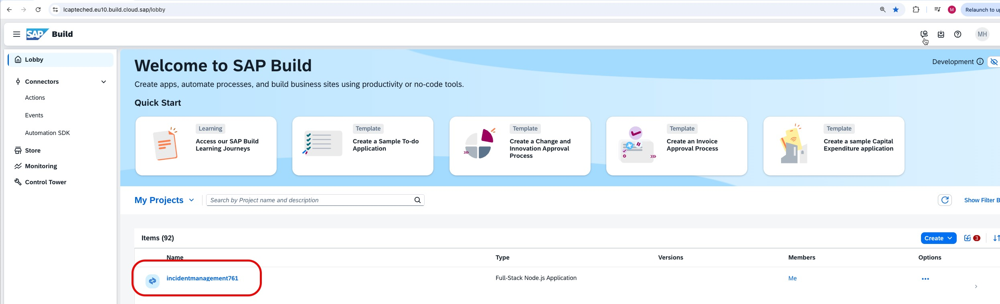 

9. Once your application is created, click on its name to open it. This will launch the SAP Build Code.

   
### 1.2 Create and explore a CAP Model

In our application we want to use the Business Partner data from our S4/HANA system. Therefore we add the connection to S/4 as a first step.

**1.2.0 Add S4/HANA external service:**

1.    Click on the **+** in the external resources on the Storyboard.

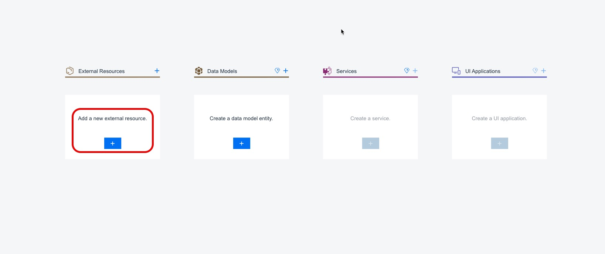 

2.    You are directed into the Service Center, showing those APIs the administrator has set up for you via the SAP Systems choice. BTP offers multiple ways to explore available APIs. The selected SAP System one provides the APIs that were added as BTP destinations for APIs or API catalogues. 

      Another option is SAP Business Accelerator Hub, which shows all the publicly available APIs from all SAP products, that you can also find directly in the SAP Business Accelerator Hub (https://api.sap.com/)

      A third option is the Developer Hub, see here, where administrators can carefully curate and govern which APIs are published to developers and to manage these APIs by securing, applying transformation or traffic management options. The last option is the Unfied Customer Landscape, which shows all the APIs that are part of a customer’s SAP and Third Party landscape.
      Take some time to explore these other options separately.

      Turn to the preselected **SAP System** choice. Select the service API_BUSINESS_PARTNER.

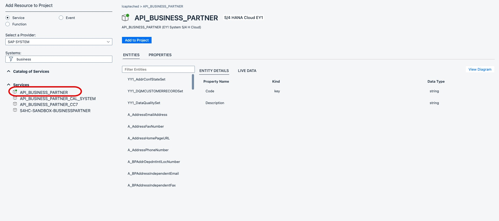 

3.    Explore its entities and respective details on the right. You can also press on the Live Data tab on the details view. As the SAP System APIs are connected to real backed systems, you can see some of the API’s data from this system. You can click on **Live Data** to check the data. Afterwards you can just click on **Add to Project**.

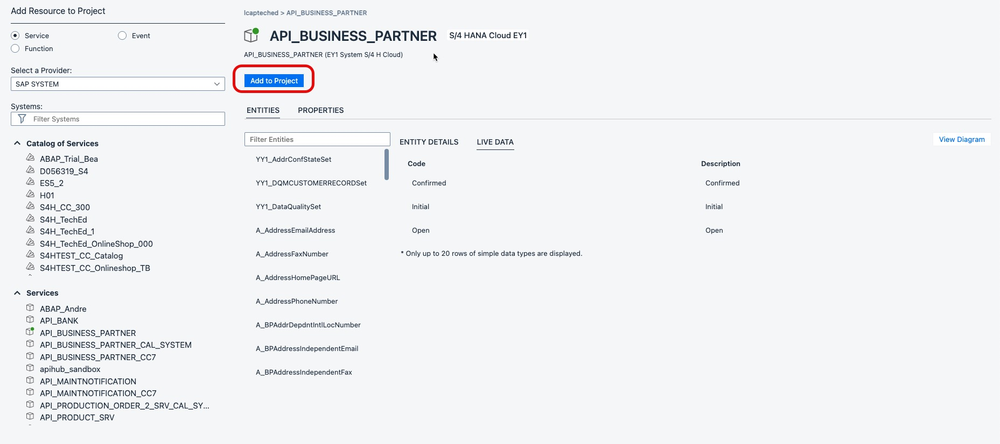 

4.    You will find the S/4 system now part of your project.

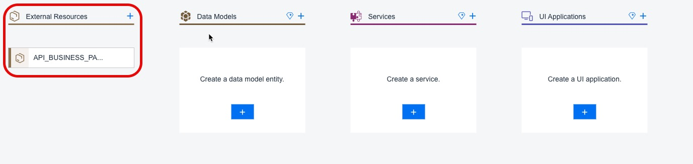 


**1.2.1 Create a new CAP application with Agentic AI:**

1.    Open Cline by clicking its icon on the left side bar   (see below screenshot).

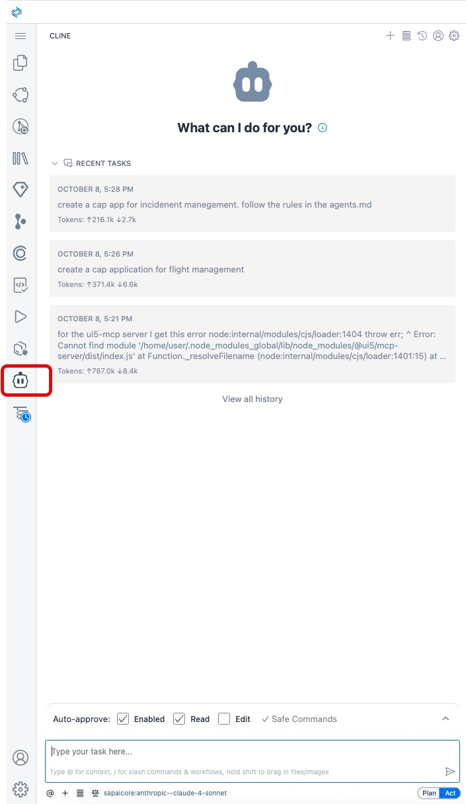 

2.    We need to add the AI Core credentials.Therefore click on the llm at the bottom of Cline.

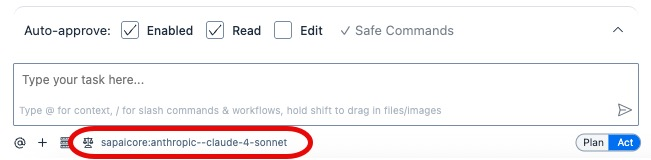 

3.    Now we have to enter the AI Core client ID and secret. You find this information in the aicore.txt file on your desktop.

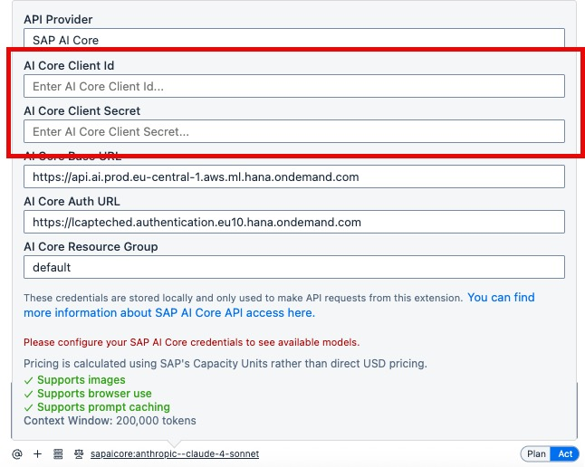 

4.    Now we can go back, by clicking on the llm at the button again.

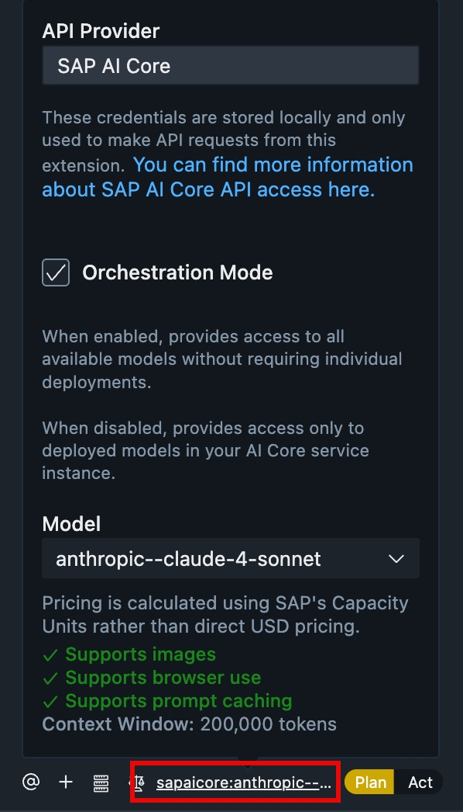 

5.    We want to start to create the incident management application. In the first step only the data model, service should be created. Copy and paste the following prompt in the input field: 


```
update the CAP application for managing customer support incidents. use the mcp server cds-mcp. Create only the data model(schema.cds) and service. The incident service should be draft enabled.

•               Incidents are directly related to BusinessPartners and contain details like title, urgency, status, and a conversation log (messages with timestamps and authors).              
•               Extend API_BUSINESS_PARTNER. Expose only BusinessPartner with READ.
•               Status and Urgency are enum types, enumerating possible incident states (new, assigned, etc.) and urgency levels (high, medium, low).

```


What will happen now:
It is recognized that the CAP MCP should be used, which will use the search_docs tool to get the latest CAP documentation to execute your prompt.

*hint* Sometimes to need to approve some steps. You have to do that.

Now you should get an proposed Data Model Architecture, which could look like this:
### Proposed Data Model Architecture

**Core Entities**:

__1. Data Model (db/schema.cds):__

- `Status` and `Urgency`: Enum entities (UUID keys, code, description), to enumerate incident states and urgency levels. Values like new/assigned/closed and high/medium/low.
- `Incident` entity: (UUID key) Contains title, status, urgency associations, and association to BusinessPartner.
- `ConversationMessage`: Entity for conversation log, with a UUID key, message, author, createdAt (timestamp), and association to `Incident`.
- Association to API_BUSINESS_PARTNER.cds: Incidents link to BusinessPartner using the string(10) key from the external service.


6. As a next step an implementation Plan should be displayed.
- __Create Data Model__ (db/schema.cds)
- __Create Service Definition__ (srv/incidents-service.cds)

You can now modify or accept the proposal and the agent will generate the necessary files.

7. We don't need any further modification, therefore switch to act plan and accept the proposal.

8. If you navigate now to your file explorer by clicking the **explorer** icon on the right side, your file structure should contain these files:

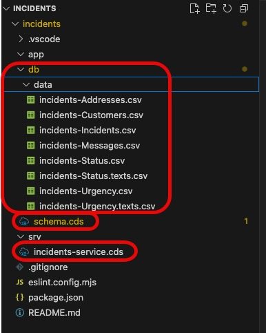 


**1.2.2 Understand the Schema**

A CAP service always consists of one or many entities that are the data model. Once the application is tested or deployed these entities result in database tables. On top of these, you have one to many services, that itself consist of service entities.

Your schema should contain now entities for incidents and messages. Let's have a closer look what was implemented by the AI agent.

1. In the db folder, you will find the **schema.cds** file. This file contains the data model.

In the beginning it includes some aspects from the common library. For example cuid and managed can be added.

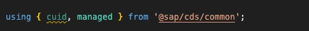 

   **cuid** is a shortcut for unique primary keys

   **managed** captues created by/at and latest modified by/at management information for records

Find more information here: https://cap.cloud.sap/docs/cds/common#aspect-cuid


Urgeny and Status will be modeled as Enum types. These are semicolon-delimited list of symbols. If our use case would require localization of values, we would have to model them as [code list](https://cap.cloud.sap/docs/cds/common#adding-own-code-lists)

If you want to find more about the, have  look at the capire documentation: https://cap.cloud.sap/docs/cds/cdl#enums


2. What you will also see in your schema that relationships between entities are created. There are two ways. Associations and Compositions.

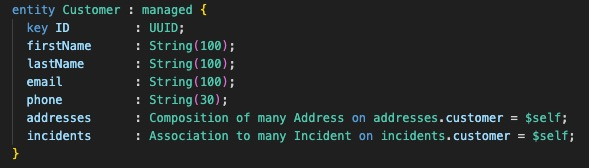 

What is the difference beween these relationships?
| Feature | Composition | Association |
| :--- | :--- | :--- |
| **Relationship Type** | A strict "part-of" or ownership relationship, modeling a parent-child structure. | A looser "uses-a" or peer-to-peer relationship between independent entities. |
| **Lifecycle** | The child entity's lifecycle is dependent on the parent. If the parent is deleted, the child is also deleted (cascaded delete). | The connected entities have independent lifecycles. Deleting one does not affect the other. |
| **Example** | A `SalesOrder` and its `Items`. The items cannot exist without the sales order header. | A `SalesOrder` and a `Customer`. The customer can exist independently of any single sales order. |


Find more information here: https://cap.cloud.sap/docs/cds/cdl#associations


**1.2.3 Understand the Service**

In the srv folder a cds file was generated that contains all the services of your application, probably called incidents-service.cds.
Currently that file should only contain simple projections on the entities.

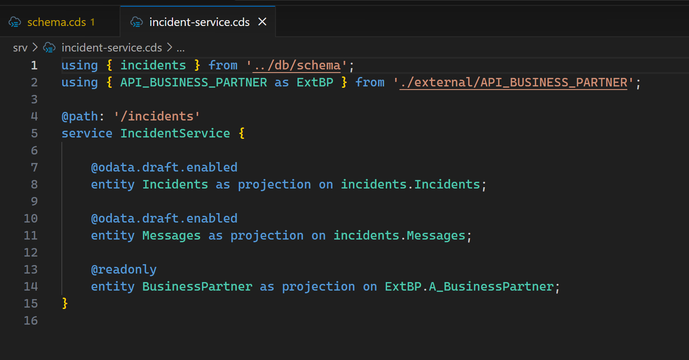 


**1.2.4 Add sample data**

Please check if you already have some sample data in your project. You can find these in folder db/data or test/data.
When you use cds watch or cds deploy, CSV files are loaded by default from test/data. However, when preparing for production deployments using cds build, CSV files from test/data are not loaded.


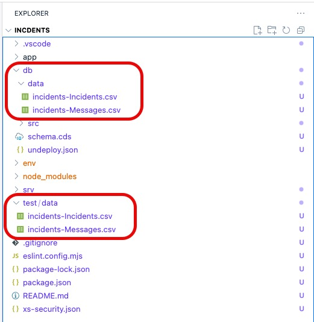 


That means if your don't have a folder **test/data** with sample data, go back to Cline and let's generate some sample data.

```
Add some meaningful sample data to the application for incidents and conversation logs. If you already have sample data in db/data move them to test/data
```


**1.2.5 Add some logic to the service with the AI Agent**

We want to extend the application with some backend logic. We will use the AI agent again for that.
Please execute the following prompt:

```
If an incident is closed, it cannot be modify anymore.
If the title of an incidents includes urgent, set the urgency to high.
```

Now a new file should be created in your srv folder called incidents-service.js.

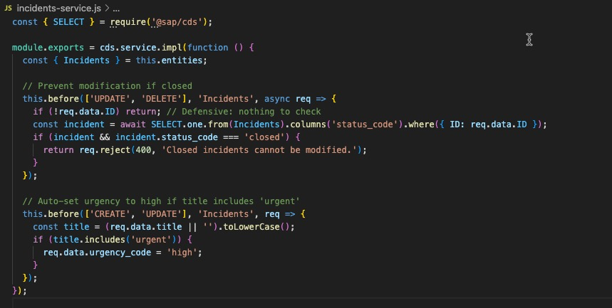

As you can see the AI agents included the logic we have requested and also two comments explaining where the logic was implemented.

**1.2.6 Preview the application**

1. Open the terminal **cds watch** to start a preview of the service:
```
cds watch
```

2. Click on **http://localhost:4004** to open the preview

3. Now select **Fiori Preview** for the incidents.

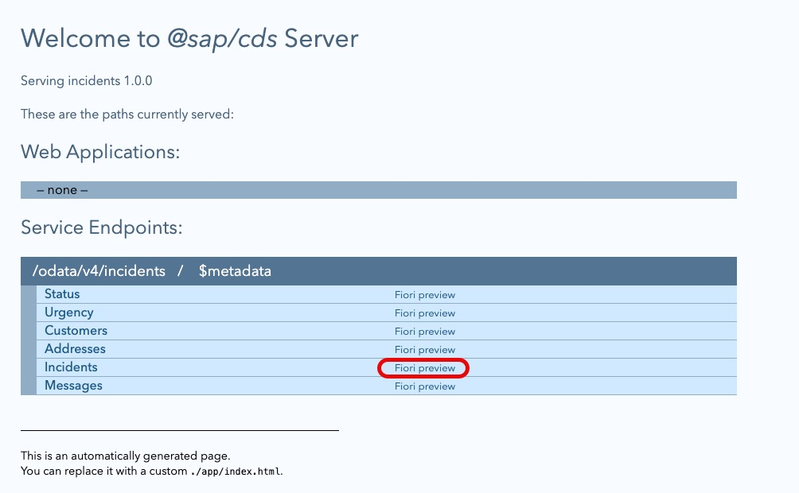

4. Add columns to see the content, therefore select the gearwheel in the middle of the UI and select all Columns afterwards.

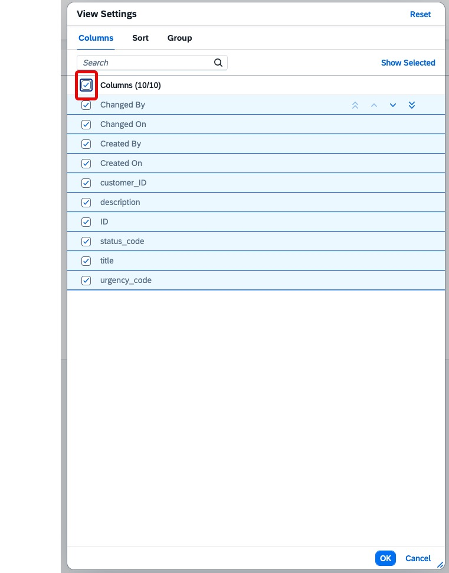

5. You will see now all the sample data.

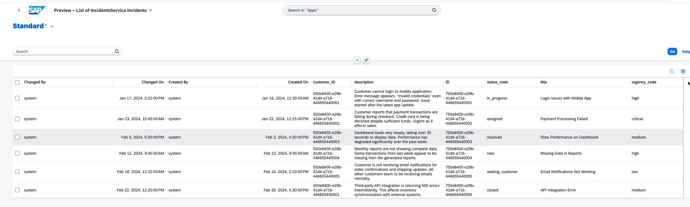

6. Go back to the development environment.


### 1.3 Use AI Agents to add UIs to the application

### 1.3.1 Create a SAP Fiori Elemts UI

Now let's add some SAP Fiori Elements UI on top. Therefore we will use our AI agents again. This time the SAP Fiori MCP server will be used by the agent.
Please execute the following prompt:

```
Create a Fiori elements list report on top for the incidents. Add the incidentsmessages to the details of the incidents.
```

You can execute the command directly in act mode.

First it will call the list_functionality tool. Second it will call the get_functionality_details.

Probably the cds-mcap is used for the search_model tool. 

You need to approve the usage of these MCP servers by clicking **approve**.

The UIs generated should look like this. Press the **go** button to display the values.

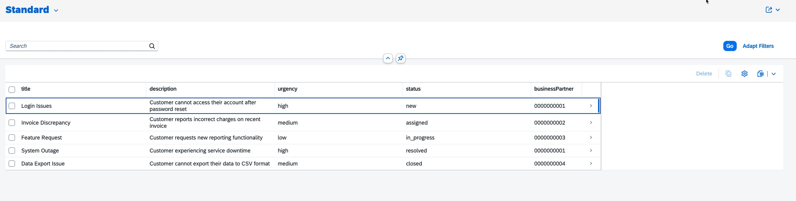

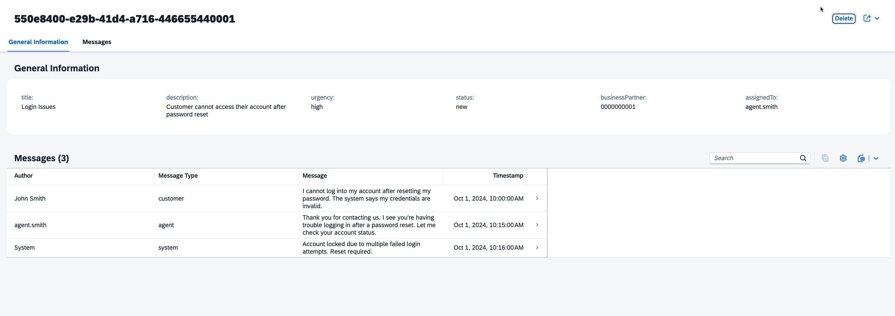

### 1.3.2 Adjust the UI Application

We want to adjust the overview page a bit, that we can easier identity urgent incidents. Use the AI Agents again with the following prompt:


```
We need identify urgent incidents better in the overview page. Therefore do the following change:
Incidents with urgency "high" should be highlighted with criticality 1 - Negative (red). "Medium" incidents with 2 - Critical (orange) and "low" incidents with 3 - Positive (green)
```

The new UI should look like this: 

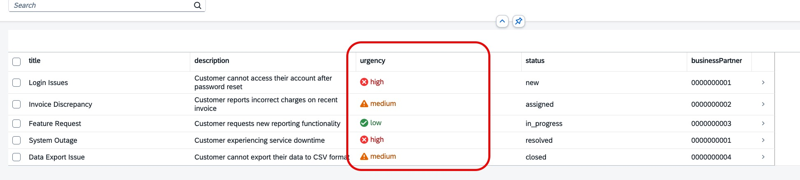


### 1.3.3 Use the S/4 Business Partner

```
if a new incident is created the businesspartner should be selected from the external S/4 system as value help. Use sample data for that.
```


This completes the first part of the tutorial.


### 1.4 Add attachments to the application 

In this part of the tutorial, another feature of the CAP framework will be added to the application: With each incident, the user should have an option to add an attachment, for example, a photo the problem description. For this, addition logic and an additional UI section is needed to maintain and show attachments for each notification. 

SAP Build Code via CAP and SAP Fiori elements make it easy to add this functionality:

1.    Open a new terminal by pressing the hamburger icon on the left side pane
2.    Select *Terminal*
3.    Select *New terminal*


4.    In the terminal, add the statement

`npm add @cap-js/attachments`

5.    Press *return*.

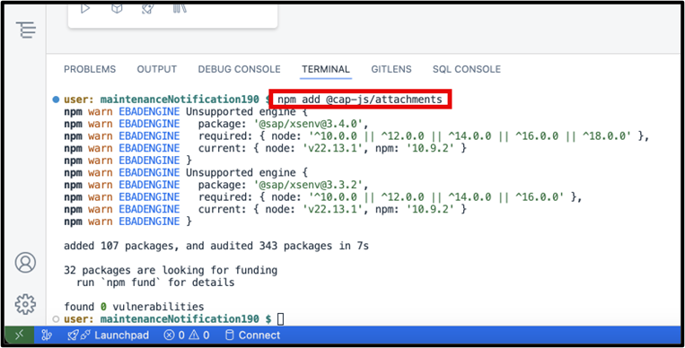

This will add a so-called *CAP plugin*, in this case one for attachment-handling. Behind the scenes, a dependency to this plugin will be added into the *package.json* file of the application and the plugin will be loaded.


6. Open Cline again and now the AI agent should extend the incidents entity with the following prompt:

```
Each Incidents should also be able to have several attachments. Use the installed plugin for that. Only update the schema.
```

7. What happened here? The Attachments plugin has been added to the file. As a last step, a new property needs to be created, called *attachments* here, which is a *Composition of Attachments.*

Your new schema.cds file should contain now these two line:

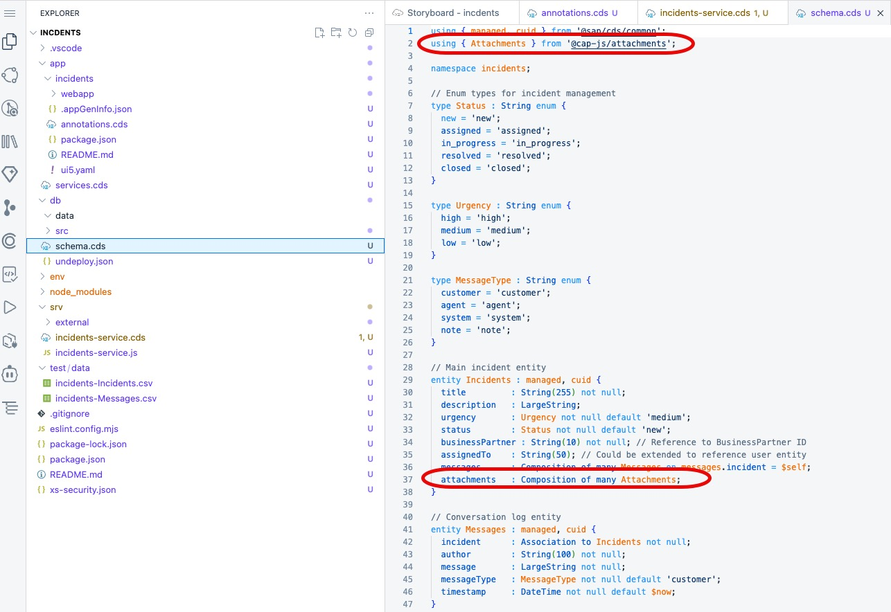 


Let’s have a look at the result:

8. If you have stopped the preview, press the green arrow on the upper right of the Storyboard again. If the preview is still running, the application should have refreshed itself.

9.    On the *Application Development Project Preview* page, press the tile *Notifications* again.

10. Create a new notification in your app by clicking *create* which you can find at the top right. You should now see a new attachment section in the application.

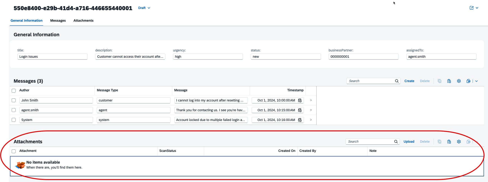 

New attachments can now be uploaded that will then appear in the list. You can also view them from that list. Each time creating a new incidents with a description, the attachments will be stored alongside the incdents.

This concludes the creation of an incidents application with GenAI in SAP Build Code. 


## Summary

You've now ...


