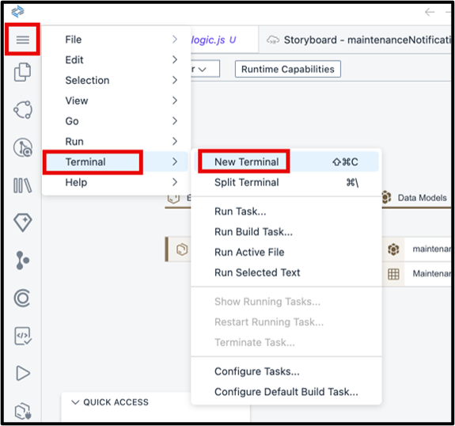

# Exercise 2 - Optional Part: Add attachments to the application 

## Exercise 2.1 Use the attachments plugin


In this optional part of the tutorial, another feature of the CAP framework will be added to the application: With each incident, the user should have an option to add an attachment, for example, a photo the problem description. For this, additional logic and an additional UI section is needed to maintain and show attachments for each notification. 

SAP Build Code via CAP and SAP Fiori elements makes it easy to add this functionality:

1.    Open a new terminal by pressing the hamburger icon on the left side pane
2.    Select *Terminal*
3.    Select *New terminal*



4.    In the terminal, add the statement

`npm add @cap-js/attachments`

5.    Press *return*.


This will add a so-called *CAP plugin*, in this case one for attachment-handling. Behind the scenes, a dependency to this plugin will be added into the *package.json* file of the application and the plugin will be loaded.


6. Open Cline again and now the AI agent should extend the incidents entity with the following prompt:

```
Each Incidents should also be able to have several attachments. Use the installed plugin for that. Only update the schema.
```

7. What happened here? The Attachments plugin has been added to the file. As a last step, a new property needs to be created, called *attachments* here, which is a *Composition of Attachments.*

Your new schema.cds file should contain now these two line:

 


Let’s have a look at the result:

8. If you have stopped the preview, press the green arrow on the upper right of the Storyboard again. If the preview is still running, the application should have refreshed itself.

9.    On the *Application Development Project Preview* page, press the tile *Notifications* again.

10. Create a new notification in your app by clicking *create* which you can find at the top right. You should now see a new attachment section in the application.

 

New attachments can now be uploaded that will then appear in the list. You can also view them from that list. Each time creating a new incidents with a description, the attachments will be stored alongside the incdents.

This concludes the creation of an incidents application with GenAI in SAP Build Code. 

## Summary

You've now extended the application with the capability to store attachments for the incidents.
